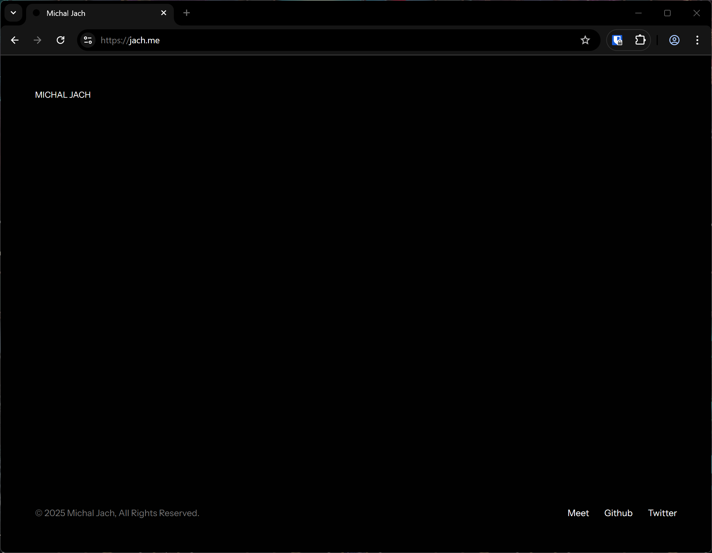

# Chrome Gotham Theme

This repository contains a Google Chrome theme package.

## Installation Instructions

1. **Download the Theme Package**
   - Clone or download this repository to your computer.

2. **Open Chrome Extensions Page**
   - Go to `chrome://extensions` in your Chrome browser.

3. **Enable Developer Mode**
   - Toggle the "Developer mode" switch in the top-right corner.

4. **Load Unpacked Extension**
   - Click the "Load unpacked" button.
   - Select the folder where you downloaded or cloned this theme package.

5. **Apply the Theme**
   - Chrome will automatically apply the theme.

## Notes

- To remove the theme, disable or remove it from the Extensions page.
- For updates, repeat the installation steps.

---
Enjoy your new Chrome Gotham theme!
